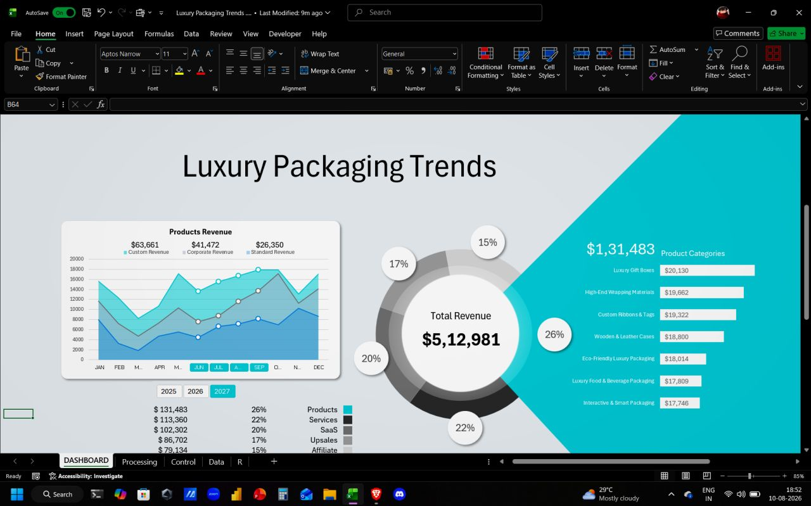

# Luxury Packaging Trends — Excel Analytics Dashboard

A practice rebuild of a YouTube dashboard tutorial, done end-to-end in Excel to learn how custom, interactive visuals are actually built (not just how they look).

## About

This project replicates a full analytics dashboard for a simulated luxury packaging business, following along with a YouTube tutorial and rebuilding every part myself — data structure, calculations, pivot tables, slicers, and custom charts. The goal wasn't just to copy the final look, but to understand *why* the underlying structure is built the way it is.

## Dashboard Structure

The workbook is organized into 4 layers:

| Sheet | Purpose |
|---|---|
| `Data` | Raw daily transaction data (dates, revenue streams, order types, product categories) |
| `Processing` | Calculations and aggregations that feed the dashboard visuals |
| `Control` | Formatting, color codes, and conditional number formats |
| `DASHBOARD` | Final client-ready view — charts, KPIs, and interactive slicers |

## What's Covered

- **Interactive filtering** — Pivot Tables + Slicers instead of static charts
- **Revenue breakdown** — Products, Services, SaaS, Upsales, Affiliate
- **Order-type analysis** — Margin and revenue compared across Custom, Corporate, and Standard orders
- **Product category demand** — Luxury Gift Boxes, High-End Wrapping Materials, Custom Ribbons & Tags, Wooden & Leather Cases, Eco-Friendly Luxury Packaging, Luxury Food & Beverage Packaging, Interactive & Smart Packaging
- **Custom chart types** — Pie, Doughnut, Bar, Area/Line/Scatter combo, and a Radar chart

## Key Takeaway

The real "trick" behind custom visuals isn't in chart formatting — it's in the Processing layer underneath it. If the underlying calculations aren't clean and correctly sequenced, even the most custom-looking chart breaks the moment the data changes.

## Tools Used

- Microsoft Excel (Pivot Tables, Slicers, Power Query concepts, native chart customization)

## Note

This is a tutorial-based practice build using simulated data — not a real client project. It's part of ongoing hands-on learning toward delivering structured, interactive dashboards for real clients.

---
Built by [Shahid](https://github.com/Shahid-fx-Trader)
